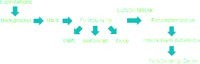
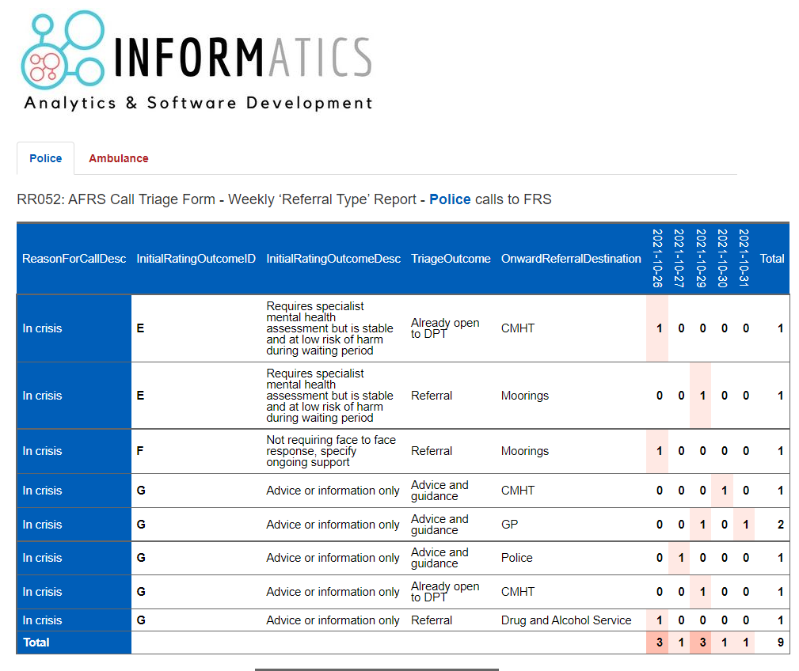
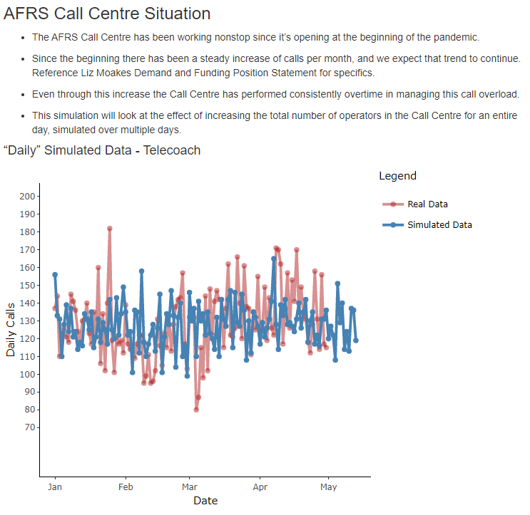
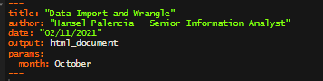

class: inverse
background-image: url(imgs/bg1.png)
background-size: contain

<style type="text/css">
.remark-slide-content {
    font-size: 30px;
    padding: 1em 4em 1em 4em;
}
</style>

<br><br><br><br><br><br><br>
# Intro to rmarkdown

<br><br>

NHS-R Conference 2021

---
class: inverse
background-image: url(imgs/bg2.png)
background-size: contain

# Title

---
class: inverse, center

# WORKSHOP PLAN

<br>

```{r, label="work_plan", echo=FALSE, out.width="100%", fig.align="center"}

```

???

This is a presenter note

---
class: inverse
background-image: url(imgs/bg2.png)
background-size: contain

# Expectations

<br><br><br>

- What is your current experience in R?
- What is your current experience with Rmarkdown?
- What do you want to take away from this workshop?
- What tools do you use for your reporting?

---
class: inverse
background-image: url(imgs/bg2.png)
background-size: contain

# What is rmarkdown?

<br>

.pull-left[
- Rmarkdown (and other packages) facilitate the development and production of highly versatile reports.
- In simplest its simplest use rmarkdown can be seen as a type of code notebook where an analyst can create reproducible and accurate historical records.
]

.pull-right[

```{r, label="logo", echo=FALSE, out.width="70%", fig.align="center"}
knitr::include_graphics('imgs/rmarkdown_hex.png')
```

]

???

rmarkdown logo here
https://rmarkdown.rstudio.com/docs/reference/figures/logo.png

---
class: inverse
background-image: url(imgs/bg2.png)
background-size: contain

# Why Is This Useful?

<br><br><br>

- The beauty of rmarkdown comes from the ability for an analyst to organise their code into an easy to read and reproducible report.
- In our data world creating reproducible analyses is essential for continuity and accuracy.

---
class: inverse

# Examples

.pull-left[

```{r, label="ex1", echo=FALSE, out.width="100%", fig.align="center"}

```

]

.pull-right[

```{r, label="ex2", echo=FALSE, out.width="100%", fig.align="center"}

```

]

???

Two images here

---
class: inverse

# Creating a Report

- Creating an rmarkdown (.rmd) file is easy!
  - Click the Paper with the green plus in the top left corner
  - Generate the type of file you want and click OK
  - DONE!

???

Three images here

---
class: inverse

# How does it work?

- rmarkdown uses markdown language to generate its reports. It also supports a variety of other languages for data generation, manipulation, and visualisation.
- rmarkdown essentially works in three main parts which we’ll look at shortly:
  - YAML – Creates and formats the specific type of report.
  - Markdown Area – Where text formatting and report outlines will go as well as some additional formatting.
  - Code area – “Chunks” where code goes that will run when the report is run.

---
class: inverse

# YAML – Yet Another Markdown Language

.pull-left[

- The YAML is used to format the report as well as specify what type of output will be created.
  - Options include HTML, PDF, Word, Powerpoint, and more...

]

.pull-right[

```{r, label="parms", echo=FALSE, out.width="100%", fig.align="center"}

```

]

???

One image here

---
class: inverse

# Markdown Area

- The Markdown Area is used to format within the report itself.
  - Examples include: Headers, Tabs, Bolds, Italics, Lists, Numbered Lists, and more...


???

One image here

---
class: inverse

# Code Area

- The Coding Area is used as a space to develop code for the rmarkdown report.
- The majority of times the final output of these code chunks will be some type of visualization (graph, table, etc.)

???

One image here

---
class: inverse

# SHOWCASE

## Let’s See Your Efforts!

---
class: inverse

# Parameterized rmarkdown

- Parameterized reports allow you to create multiple reports with different inputs (like working with functions)
  - The input parameter will take the location of every named parameter space


???

Two images here

---
class: inverse

# Functions for rmarkdown Automation

- Since rmarkdown itself is a package there are some functions that can be used to generate reports on the fly.

---
class: inverse

# Demo

- There are a multitude of packages that can work in conjunction with rmarkdown, therefore allowing an analyst to create dynamic or interactive reports, giving a more dashboard feel.

---
class: inverse

# Acknowledgements

- NHS-R Community
- Chris Beeley
- Zoe Turner
- Mohammed Mohammed

---
class: inverse, center, middle

# Get Started
