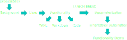
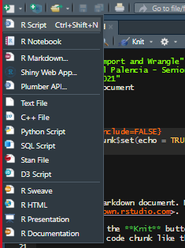
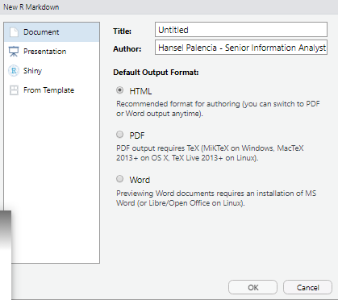
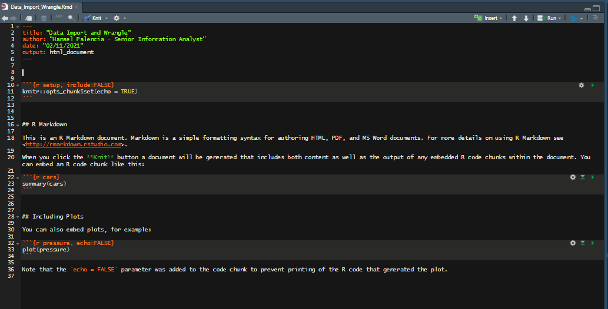
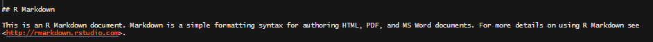
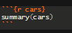
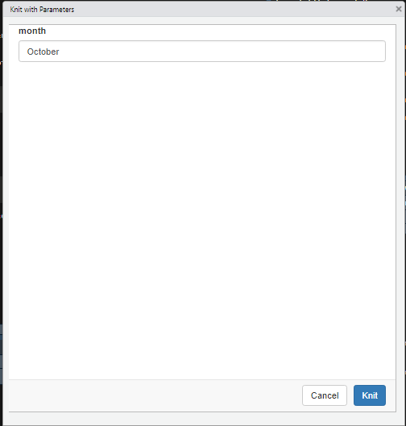

class: inverse

layout: true
background-image: url(imgs/bg2.png)
background-size: contain
background-position: top

---
background-image: url(imgs/bg1.png)
<br><br><br><br><br><br><br>
# Intro to rmarkdown

<br><br><br><br>

NHS-R Conference 2021

---
class: center
background-image: ""

# WORKSHOP PLAN

<br>

```{r, label="work_plan", echo=FALSE, out.width="100%", fig.align="center"}

```

???

This is a presenter note.
If the images are to big: background-position: top

---
# Expectations

<br><br><br>

- What is your current experience in R?
- What is your current experience with Rmarkdown?
- What do you want to take away from this workshop?
- What tools do you use for your reporting?

---
# What is rmarkdown?

<br>

.pull-left[
- Rmarkdown (and other packages) facilitate the development and production of highly versatile reports.
- In simplest its simplest use rmarkdown can be seen as a type of code notebook where an analyst can create reproducible and accurate historical records.
]

.pull-right[
```{r, label="logo", echo=FALSE, out.width="70%", fig.align="center"}
knitr::include_graphics('imgs/rmarkdown_hex.png')
```
]

???

rmarkdown logo here
https://rmarkdown.rstudio.com/docs/reference/figures/logo.png

---
# Why Is This Useful?

<br><br><br>

- The beauty of rmarkdown comes from the ability for an analyst to organise their code into an easy to read and reproducible report.
- In our data world creating reproducible analyses is essential for continuity and accuracy.

---
# Examples

<br>

.pull-left[
```{r, label="ex1", echo=FALSE, out.width="100%", fig.align="center"}

```
]

.pull-right[
```{r, label="ex2", echo=FALSE, out.width="90%", fig.align="center"}

```
]

---
# Creating a Report

<br><br><br>

.pull-left[
- Creating an rmarkdown (.rmd) file is easy!
  - Click the Paper with the green plus in the top left corner.
  - Generate the type of file you want and click OK.
  - DONE!
]
--
.pull-right[
```{r, label="file1", echo=FALSE, out.width="50%", fig.align="center"}

```
]

---
# Creating a Report

<br><br><br>

.pull-left[
- Creating an rmarkdown (.rmd) file is easy!
  - Click the Paper with the green plus in the top left corner
  - Generate the type of file you want and click OK
  - DONE!
]

.pull-right[
```{r, label="file2", echo=FALSE, out.width="85%", fig.align="center"}

```
]

---
# Creating a Report

<br><br><br>

.pull-left[
- Creating an rmarkdown (.rmd) file is easy!
  - Click the Paper with the green plus in the top left corner
  - Generate the type of file you want and click OK
  - DONE!
]

.pull-right[
```{r, label="file3", echo=FALSE, out.width="100%", fig.align="center"}

```
]

---
# How does it work?

<br><br><br>

- rmarkdown uses markdown language to generate its reports. It also supports a variety of other languages for data generation, manipulation, and visualisation.
- rmarkdown essentially works in three main parts which we’ll look at shortly:
  - YAML – Creates and formats the specific type of report.
  - Markdown Area – Where text formatting and report outlines will go as well as some additional formatting.
  - Code area – “Chunks” where code goes that will run when the report is run.

---
# YAML – Yet Another Markdown Language

<br><br><br>

.pull-left[
- The YAML is used to format the report as well as specify what type of output will be created.
  - Options include HTML, PDF, Word, Powerpoint, and more...
]

.pull-right[
```{r, label="parms", echo=FALSE, out.width="100%", fig.align="center"}

```
]

---
# Markdown Area

<br><br><br>

- The Markdown Area is used to format within the report itself.
  - Examples include: Headers, Tabs, Bolds, Italics, Lists, Numbered Lists, and more...


```{r, label="markdown", echo=FALSE, out.width="100%", fig.align="center"}

```

---
# Code Area

<br><br><br>

.pull-left[
- The Coding Area is used as a space to develop code for the rmarkdown report.
- The majority of times the final output of these code chunks will be some type of visualization (graph, table, etc.).
]

.pull-right[
```{r, label="chunk", echo=FALSE, out.width="50%", fig.align="center"}

```
]

---
background-image: url(imgs/bg1.png)

<br><br><br><br><br><br><br>

# SHOWCASE

<br><br><br><br>

Let’s See Your Efforts!

---
# Parameterized rmarkdown

<br><br><br>

.pull-left[
- Parameterized reports allow you to create multiple reports with different inputs (like working with functions).
  - The input parameter will take the location of every named parameter space.
]

.pull-right[
```{r, label="params_file1", echo=FALSE, out.width="100%", fig.align="center"}

```
]

---
# Parameterized rmarkdown

<br><br><br>

.pull-left[
- Parameterized reports allow you to create multiple reports with different inputs (like working with functions).
  - The input parameter will take the location of every named parameter space.
]

.pull-right[
```{r, label="params_file2", echo=FALSE, out.width="70%", fig.align="center"}

```
]
---
# Functions for rmarkdown Automation

<br><br><br>

- Since rmarkdown itself is a package there are some functions that can be used to generate reports on the fly.

---
# Demo

<br><br><br>

- There are a multitude of packages that can work in conjunction with rmarkdown, therefore allowing an analyst to create dynamic or interactive reports, giving a more dashboard feel.

---
# Acknowledgements

<br><br><br>

- NHS-R Community
- Chris Beeley
- Zoe Turner
- Mohammed Mohammed
